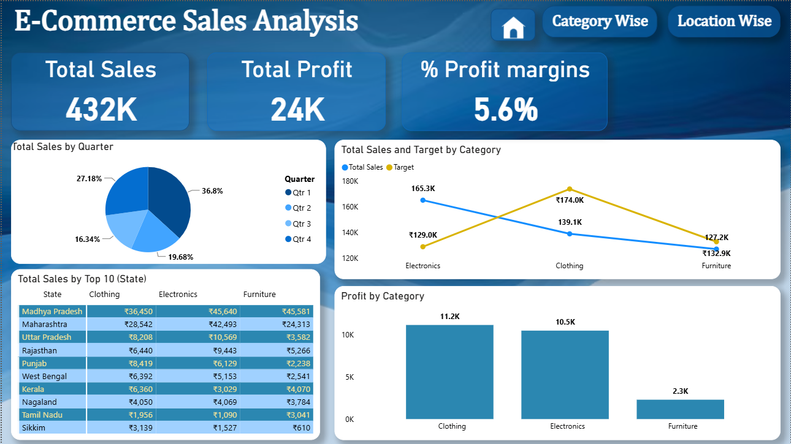
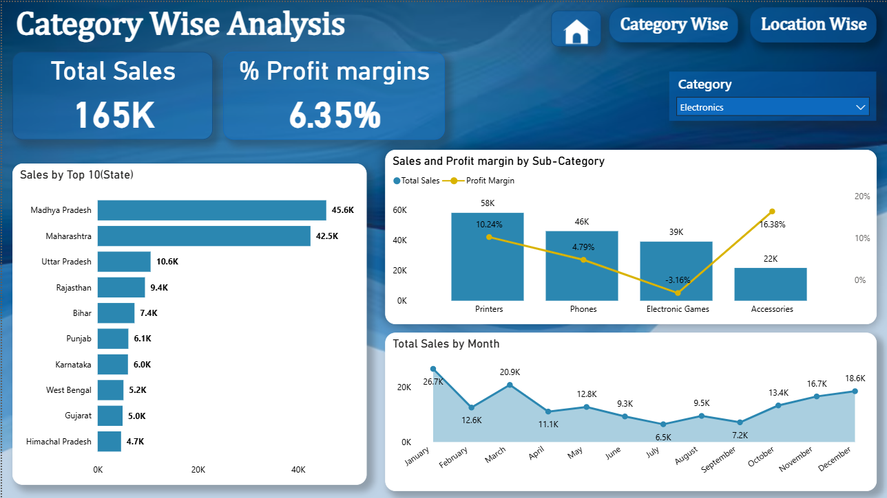
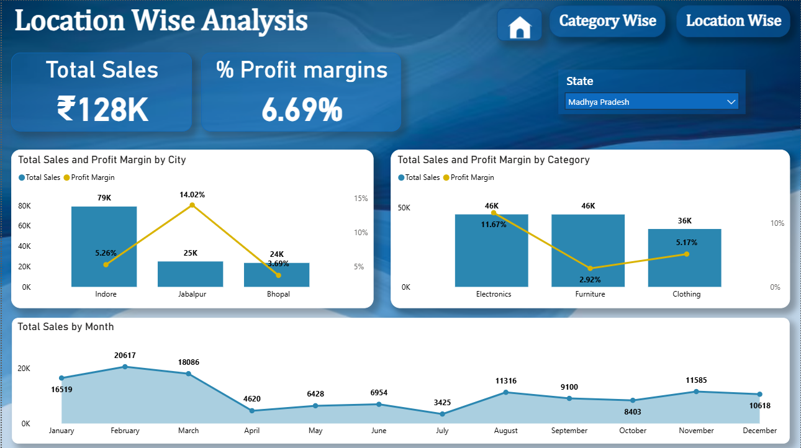

# 📊 E-Commerce-Sales-Dashboard

An interactive **Power BI dashboard** built to analyze e-commerce sales performance across different product categories and locations. The dashboard enables users to monitor key business metrics such as sales, profit, profit margin, category performance, and state-wise sales through interactive visuals and filters.

---

## 📌 Project Overview

This dashboard provides a comprehensive analysis of e-commerce sales data using Power BI. It is divided into three interactive pages that allow users to explore sales performance from different perspectives.

- **Home Dashboard** – Overall business performance
- **Category Wise Analysis** – Detailed analysis by product category
- **Location Wise Analysis** – Sales analysis by state and city

---

## 📈 Dashboard Pages

### 🏠 Home Dashboard

The Home page provides an overview of business performance.

**KPIs**
- Total Sales: **₹432K**
- Total Profit: **23.96K**
- Profit Margin: **5.55%**

**Visuals**
- Quarterly Sales Distribution
- Sales vs Target by Category
- Profit by Category
- Top 10 States Sales Table

---

### 📂 Category Wise Analysis

This page allows users to analyze sales based on product categories.

**Features**
- Category Filter
- Total Sales
- Profit Margin
- Top 10 States by Sales
- Sales & Profit Margin by Sub-Category
- Monthly Sales Trend

Example:
- Electronics generated approximately **₹165K** in sales with a **6.35%** profit margin.

---

### 📍 Location Wise Analysis

This page focuses on geographical sales performance.

**Features**
- State Filter
- Total Sales
- Profit Margin
- Sales & Profit Margin by City
- Category-wise Sales within Selected State
- Monthly Sales Trend

Example:
- Madhya Pradesh recorded approximately **₹128K** in sales with a **6.69%** profit margin.

---

## 📊 Key Insights

- Clothing generated the highest overall profit.
- Electronics recorded the highest category sales.
- Madhya Pradesh was the top-performing state.
- Sales fluctuate across different months, showing seasonal trends.
- Interactive filters allow users to drill down by category and location.

---

## 🛠 Tools Used

- Power BI Desktop
- Power Query
- DAX
- CSV Dataset
- Data Modeling

---

## 📂 Dataset

The dashboard is built using the following datasets:

- List of Orders.csv
- Order Details.csv
- Sales Target.csv

---

## 📷 Dashboard Preview

### Home Dashboard

---

### Category Wise Analysis

---

### Location Wise Analysis

## 💡 Skills Demonstrated

- Data Cleaning with Power Query
- Data Modeling
- DAX Measures
- Interactive Dashboard Design
- KPI Development
- Data Visualization
- Business Intelligence Reporting

---

## 🎯 Future Improvements

- Year-over-Year Sales Analysis
- Customer Segmentation
- Top Customers Dashboard
- Forecasting
- Advanced KPI Cards
- Drill-through Pages

---

## 👨‍💻 Author

**Your Name**

GitHub: [https://github.com/YourUsername](https://github.com/Abhijeetr05)

LinkedIn: [https://linkedin.com/in/YourProfile](https://www.linkedin.com/in/abhijeet-rajput09/)
